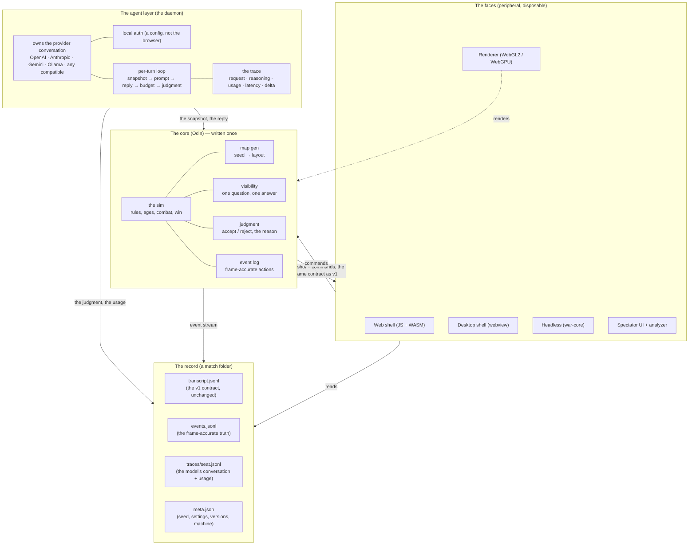

# When Agents Rule — the v2 Rebuild

**Status.** A proposal. Not yet a build. It sits on top of
[`DESIGN_SPEC.md`](./DESIGN_SPEC.md), which is the contract: the spec says *what must be
true*; this document says *what we build, in what order, and how each step proves
itself*. Where this document names a stack, it is a **decision for a rebuild** in the
spec's sense (§11.3, §13) — the spec records the *requirement*, this record records the
*choice*, and each choice below names what it costs and what was rejected.

**One sentence.** Invert the center of gravity. v1 is *a browser game that calls
language models*; v2 is *a deterministic simulation with several faces* — a browser, a
desktop app, a headless server — where the model harness is one well-specified peripheral
and the record of every match is complete by construction.

---

## 1. Why rebuild, and what "better" means here

The spec is written so that *the current build's technology is not its design*. But the
current build does have five properties that its own technology made load-bearing, and
each of them bounds what the product can become:

| v1 property (a consequence of the stack) | What it bounds | v2 answer |
|---|---|---|
| The sim, the harness, and the renderer are **one 1.5 MB browser bundle** (`game.js` 312 KB, `openai-ai.js` 577 KB, `ui.js` 377 KB) | No headless run, no multi-seat across machines, no server, and the model's turn budget is entangled with the page's frame budget | **One deterministic core, compiled to every face** (§4) |
| **The harness runs in the browser**, with the provider key in the user's local storage | The only trace is the 300-frame snapshot stream; a full-fidelity record of *why* a model did what it did is not capturable, because the conversation never leaves the page | **The harness becomes a service that owns the conversation and writes the trace** (§5) |
| **The record is one file** (the transcript, §5.1), captured at a snapshot cadence | §5.6's stated gap — "what the transcript cannot show": what the units did in the gaps, what the provider was doing in flight, the request that never reached a server — is *permanently* a gap | **The record becomes a folder**: the transcript, a frame-accurate event stream, and a per-seat trace, all schema-versioned and queryable offline (§6) |
| **The renderer is the sim's only consumer** and is in the same bundle | The visual is frozen at "flat primitive composition"; investing in the look would touch the match logic | **The renderer becomes a disposable peripheral with its own phase and its own budget** (§7) |
| **One machine, one match** (the page is the authority) | No hosted multi-machine matches, no batch benchmark corpus, no A/B across models with one click | **The headless core *is* the natural server: one core, N clients** (§8) |

None of these five are *bugs* — the spec is careful to flag each as a build constraint
a rebuild may decide freely. The proposal's claim is that **deciding all five in the
same direction** (out of the browser, into a core + a service + a folder) is what makes
"better performance, multi-platform, deeper traces, better visual, multiplayer, better
tracking" *one* rebuild instead of five incompatible ones.

**The three bets, stated plainly:**

- **B1 — The simulation is a separate, deterministic core, written once and run
  anywhere** (a browser via WebAssembly, a desktop and a server natively). The renderer,
  the harness, and the recorder become disposable peripherals around it.
- **B2 — The agent harness is a service (a daemon), not an in-page script.** It owns the
  provider conversation, the auth, the retry, the token accounting, and — new — the full
  per-turn trace. The transcript is *what happened*; the trace is *why and how*.
- **B3 — The record of a match is a folder, not a file.** The existing transcript
  contract is preserved byte-for-byte; beside it, an event stream (the frame-accurate
  truth) and a per-seat trace (the model's conversation, the raw usage, the delta, the
  timing). All three are append-only, schema-versioned, and readable by any offline tool
  that ships.

Each bet has a **gate**: a concrete, checkable proof that the bet paid off before the
next one begins (§9).

---

## 2. The platform matrix

One core, one UI codebase, **five faces**. "What runs where, what each gets, and what
the input model is":

| Face | Shell | The core | The renderer | The harness | The record | The input model |
|---|---|---|---|---|---|---|
| **Browser** (the existing primary — **v1, the parent's to own**) | a static folder over HTTP (`fetch` needs it; `file://` does not work) | the JS rules as shipped — **v2 ships no browser core** (spec §14) | WebGL2 (a WebGPU path, progressive) | the daemon, or a thin in-page fallback for the zero-config case | the match folder, exported on end | mouse + keyboard, as today |
| **Desktop** (new) | one native binary + a webview we own (Win / macOS / Linux) | native, **Odin** | the same renderer, in the native webview | the daemon | the match folder, **direct file I/O** (no browser download friction) | mouse + keyboard + **gamepad** + multi-monitor + always-on-top |
| **Headless / server** (new) | one binary, `war-core` | native, single process, **Odin** | none (a null renderer; a match runs unwatched per §11.1) | the daemon | the match folder, on disk | `--serve` (a hosted match: N clients attach), `--batch` (a benchmark matrix), `--record` (a silent ghost match) |
| **Hosted arena** (new, P4) | the headless binary, `--serve`, over a WebSocket | native | the clients' renderer | the daemon, on the host or on a remote seat's machine | the match folder, canonical on the host | a human on a laptop, an agent on another machine, a spectator anywhere |
| **Mobile** (later) | the web build, responsive | WASM | the same renderer, read-only | a spectator (no agent seat) | a read-only replay view | a spectator; a full agent seat is **out of scope** (an input model, not a rendering problem) |

**Why Tauri was rejected** (this section recommended it until 4 October 2026). One fact,
found after the language choice was made: **Tauri's backend is Rust** (spec §14). Under an
Odin core that is three languages in one product — JS UI, Rust shell, Odin sim — the exact
opposite of why Odin was picked. The replacement is a webview we own behind one thin C ABI
(WebView2 / WebKitGTK / WKWebView), served by the same binary, which keeps every reason
Tauri was attractive: the same web UI, native file dialogs with no browser download, the
low-latency audio path (`miniaudio`, vendored), multi-monitor, always-on-top and gamepad.
Electron stays rejected on weight; a full native UI stays rejected as a rewrite of the least
deterministic part of the product, parked as spec §13.12 for whoever wants it. The real cost
is honest: three small OS-specific shims, owned here, instead of one dependency.

**Why a headless binary at all**: the spec's headline property is *the match must run
unwatched* (§11.1). v1 achieves that with a worker-driven clock inside a browser tab that
nobody is looking at — which works, but it keeps the harness, the keys, and the record
tied to a browser process. The headless core is the same property *without the browser*: a
match is a process, a record is a folder, and a *corpus* is a batch. That is where
"better tracking" and "multiplayer" and "batch benchmarking" all actually live.

**The "no build step" tradeoff, stated:** v1's README claims *runnable straight from a
folder, zero dependencies*, and the spec flags that as a **product claim, not a design law**
(§11.3). v2 relaxes it deliberately but **not for the browser**: the web build keeps the claim
verbatim, because the browser still runs the JS rules unchanged. What is compiled is the
native core, and only for the faces that want a process — so the v2 README says "one binary,
no runtime to install" while the page still says "open the folder", and §11.3's flag is
closed by writing both sentences rather than by arguing about them (spec §14).

---

## 3. The system shape



Read the diagram as **three contracts, not three technologies**:

- **The core's contract** is the *state + command dialect* the spec already pins
  (§4.2, §12): one JSON object per seat-turn, a twelve-action vocabulary, a refusal that
  is a fact with a cause. v2 does not change this dialect; it changes *where it is
  implemented* and *who else can speak it* (a remote agent, a headless batch, a
  benchmark). The spec's "one question, one answer, one authority" (§3.3.1) is what makes
  the dialect portable: the core is the single authority, and every face — the browser,
  the desktop, the server, the analyzer — reads *it*, never a copy.
- **The agent's contract** is the *per-turn loop* the spec pins (§4.3, §4.4): the
  structure and order of the message, the provider dialects, the output budget, the
  late-answer and rejection semantics. v2 moves the *owner* of that loop out of the page
  and into the daemon, and adds two things the loop now emits that v1 could not: the
  **state delta** (what changed since the prior snapshot — the "what the model saw
  happen") and the **decision latency** (the full timing of a turn). The *numbered*
  judgment semantics — accept/reject, the reason, the plan tool, the 3-command budget —
  are preserved so that an old transcript and a new one remain comparable across a
  corpus (§6.4).
- **The record's contract** is the spec's §5: append-only, line-oriented, key-free,
  endpoint-free, versioned, one-match lifetime. v2 preserves the transcript *exactly*
  and adds two siblings (the event stream, the trace) that close the §5.6 gap. The
  folder is the artifact; the three files in it answer three different questions
  (§6.1).

---

## 4. The core (the sim)

**Language: Odin.** Decided 4 October 2026: the record is spec §14 ("No Rust for the
Wicked"), the arithmetic and the tooling research are `docs/CORE-REPLAN.md`. What changed was
not Odin's qualities but this section's premise — one compiled language was wanted because
one source had to reach a browser's WASM, a desktop process and a server. With no browser
core the premise is gone, and what is left of the case Odin answers directly: no GC, no
runtime, a C ABI, one build command, a linter in the compiler, a test runner with a memory
tracker, and a vendored set that covers this product's native needs (`sdl3`/`glfw` for the
window, `miniaudio` for §8's audio, `nanovg`+`microui` if §7's look is ever wanted outside a
DOM, `cgltf`/`stb`/`zlib` for content, `lua` for scenarios, `ENet` with `ggpo` for §8's
hosted arena — rollback netcode for a sim that is already deterministic and byte-replayable,
which is the half most projects have to build first).

**Considered and rejected, for the record:**

- **TypeScript** (compile to both a JS bundle and, with care, a Node server). Rejected
  because it does not close the gap that motivated the rebuild: a TS sim in a browser is
  *still* a JS bundle entangled with the page, and a TS "server" is a Node process —
  i.e. it buys the multi-face shape *and* keeps the v1 performance and the GC-in-the-hot-
  path cost. It is the *weaker* version of the same idea.
- **C++** (the "obvious" game choice). Rejected on toolchain: a C++ core that must build
  to WASM *and* to three desktop OSes *and* a headless server, with a CMake or Makefile
  per target, is a build-system tax the project does not need, and it gives no memory
  safety for the one part of the system that runs unattended for hours.
- **WASM directly, without a native path.** Rejected because the headless and the server
  *are* the point of B1/B3; a WASM-only core cannot be the canonical record-keeper of a
  hosted match.
- **Rust, as the core language — retired rather than failed** (spec §14.2). The port it
  replaces still reproduces the reference map byte for byte (942 nodes, 47,097 bytes) and
  turn 1 on four seats, and stays available as the tagged reference `rust-core-final-b1040`.
  Retired because it is 7% of the rules written in the highest-review-cost language on the
  table, and a port nobody is eager to finish is not a foundation. One measurement reopens
  it: if Odin's object files cannot be kept free of fused multiply-add (spec §14.3),
  determinism outranks preference, in writing.

**The determinism contract (the golden rule).** The sim is **single-threaded,
fixed-timestep, seeded, with a fixed-point or deterministic-float discipline** (Rust
floats are deterministic if the operation order is fixed; the balance-critical numbers —
damage, cost, age — are integer or fixed-point, and the discipline is stated, not
implied). The spatial hash, the command queue, the win-condition checks, and the fog
updates all run on the **sim clock** (the spec's §3.1: real elapsed time sliced into
bounded quanta, never on the render loop). The renderer reads a **read-only snapshot one
frame behind** — the sim never waits for a draw.

This directly closes **§13.1, "the second clock"**: v1 has five wall-clock reads inside
the sim (a 4 s retaliation window, a 10 s "recently damaged" query, battle clumping, a
1 s combat-multiplier reset, a 150 ms turn budget) that make *full* byte-reproducibility
depend on wall time, and v1 ranks that "still open." Routing every one of them through
the sim clock is not a refactor, it is the *definition* of the core, and it lets v2 make
the claim v1 could not: **"the same seed, the same match, bit for bit"** — a claim the
event stream then *verifies* rather than asserts (§6.2).

**Verification: differential testing is the gate.** The existing 35+ test files are the
contract, and they run **against the new core at its native boundary**, not deleted
and rewritten. The golden test is: for a set of seeds, the new core produces the same
*state sequence* (the serialized form the state contract already pins, §5.4) as the
shipped JS sim and the shipped sample corpus. That is the single most important test in
the rebuild — it is the proof that "porting the sim" did not silently change the game.
The spec's §12 invariants list is the acceptance checklist for it, and each line keeps
its cross-reference.

**Performance target (a number, so it is checkable):** the *same scene* the current
game runs at 60 fps on a mid desktop runs at 60 fps in v2's desktop build; the unit cap
for the showcase grows roughly 3×. The browser face targets the current 300-unit
benchmark at 30 fps. The goal is *not* "faster than the current game" — it is "the
same game, with headroom," so the §7 visual work and the §6 record work have room to
exist without stealing the sim's time.

**The rule-based brain moves into the core, not beside it.** v1's rule-based AI (§4.6)
is the campaign opponent and the on-death fallback, and it is *fog-limited exactly like
the models*. In v1 it lives in the browser bundle; in v2 it is a port of the same
decision policy into the core, so that (a) the campaign works identically on every face,
(b) the headless `--batch` and `--record` modes can run a *full* match of rule-based
seats with no model and no browser at all, and (c) the "fallback to the rule-based
brain when an endpoint dies" rule (§4.6) is a *core* event, recorded in the event
stream, not a UI-side substitution.

---

## 5. The agent layer (the daemon)

**What it is.** A small local service that *owns the provider conversation*. v1's
`openai-ai.js` is 577 KB of in-page code that fetches to OpenAI / Anthropic / Ollama /
Google, adapts four dialects, does the retry, the budget, the judgment, and — critically
— *discards the raw conversation* after each turn (it keeps the 600-character collapsed
reply in the model's history and the 300-frame snapshot in the transcript; the actual
request and response are gone). v2's daemon does the same work **and** writes it down.

**Why a service and not a bigger script:**

- **The key stops living in the browser.** v1 stores provider credentials in the user's
  local storage, in plain text, with an explicit warning at export (a build constraint
  the spec names, §11.3). The daemon holds the key in a local config (a keychain or a
  file only the daemon reads), and the browser face never sees it. This is the single
  biggest *security* improvement in the rebuild, and it falls out of B2 for free.
- **The full request is capturable.** The spec's §5.6 says a transcript cannot show
  "what a seat's provider was doing while in flight, or anything about a request that
  never reached a server." A daemon that *is* the client can, by construction: it logs
  the request it sent (the prompt, the tools, the budget), the response it got (the
  reply, the reasoning if the provider exposes it, the raw usage — tokens *and*, where
  the provider reports it, cost — kept in the trace tier, redacted on export per the
  §5.3 rule), and the timing of each. That is the "deeper trace" the user asked for, and
  it is a *record*, not a log: schema-versioned, append-only, and queryable by the
  analyzer offline.
- **The multi-face harness is one code path.** The daemon speaks the *same* normalized
  dialect the spec pins (§4.4: four provider dialects normalized at one point; named
  tools; a system prompt; a message history; an output budget). The browser face, the
  desktop face, and a remote agent seat all talk to *a* daemon over a local boundary;
  none of them re-implements the retry, the rate-limit handling, the late-answer
  accounting, or the judgment.

**The per-turn loop, made explicit** (the spec's §4.3/§4.4, now with the additions the
daemon enables):

1. **The snapshot** — the seat's state JSON, *exactly* the v1 contract (§4.2): the
   visibility-gated view, the twelve-action vocabulary, the invariants stated in the
   model's own language. Unchanged.
2. **The prompt** — assembled in the same order (the prior results first, then the
   state, then the turn's question), with the same per-seat language and the same
   system-prompt template.
3. **The reply** — parsed for the tool calls (up to three commands) and the optional
   plan, *the same way v1 parses them* (so a model's behavior is comparable across
   v1/v2 transcripts).
4. **The budget** — the three-command limit, enforced at the one normalization point.
5. **The judgment** — each command accepted or rejected *with the named gate that
   failed and the answer to it* (§3.3.3: "a refusal is a fact with a cause, in the
   model's next context"). The numbered semantics are preserved verbatim.
6. **The seal** — the turn's record is written: the transcript line (v1 format), the
   **delta** (what changed in the state since the prior snapshot — new, and the raw
   material for the analyzer's causal chains), the **trace** (the request, the reply, the
   reasoning, the raw usage, the timing), and the event-stream lines for any action that
   changed the board.

**The state delta** is the new primitive worth naming on its own: it is *what the model
saw happen between its turns*, as a structured list (a unit moved, a node deple
ted, a
building finished, a seat advanced an age, a battle reported). v1's transcript implies it
(difference two 300-frame snapshots) but never *states* it; v2 computes it in the core
and writes it, so the analyzer can answer "what did the model see that made it do this?"
without re-simulating — which is the §5.6 gap, closed.

**The decision latency** is the other new primitive: the wall time of the turn, broken
into *queue* (how long the daemon waited to be asked), *request* (the round trip to the
provider), *parse* (the reply's arrival), and *execute* (the sim applying the commands).
v1 measures a coarse latency per seat; v2 measures the *shape* of a turn, which is what
"latency as a strategic variable" (§0) actually means and what a benchmark needs.

**The coach channel (new, bounded).** v1 has an *advice* box: one-shot, ≤400 characters,
queued onto a seat, appended to the seat's next turn, tagged "weigh it, you still
decide" (§6.3). The spec is careful that this is *never* a plan the harness makes for the
model. v2 keeps that boundary exactly, and adds one controlled extension: a **coach
note** — a free-text, per-seat, human-written note the daemon appends to a seat's
prompt the same way advice is, with the same "you still decide" tag, and the same
recording (it appears in the trace and in the transcript's model-facing history). The
point: *a human can coach a model mid-match in v2 the way a coach in the pit coaches a
driver*, and every note is in the record. This is a *spectator-interaction* upgrade, not
a gameplay one — the model is never *forced* by it, and the spec's "the harness never
plans" (§4.3) is preserved because the note is a *message to the model*, not a command
the harness executes.

**The fallback brain stays, and is a core citizen.** When a model's endpoint dies
mid-match, the seat falls back to the rule-based brain (§4.6) — in v2 that is a core
event, recorded in the event stream with the seat, the turn, and the reason, so a
transcript and a trace agree on *who drove which turn* even across a provider outage.

---

## 6. The trace and the analysis

**The match folder is the artifact** (the spec's §5.1, generalized). v1: one file
(`transcript.jsonl`), one-match lifetime, offered at the end, never accumulated. v2: a
folder, same lifetime, same offer, same *no accumulation behind the user's back* — but
with four files, each answering a different question:

```
match/
  meta.json            the conditions (the v1 header, plus versions + machine)
  transcript.jsonl     what the model was shown / said / was told  (v1 contract, unchanged)
  events.jsonl         what the board did, frame-accurate            (new)
  traces/
    seat-A.jsonl       what the provider did, per turn                (new)
    seat-B.jsonl
  …
```

- **`transcript.jsonl` is the v1 contract, byte-for-byte.** Same record types, same
  order (conditions first, turns in between, outcome last), same redaction (no key, no
  endpoint, no cost, ever — §5.3), same versioning (the state schema checked against the
  *latest* shipped sample, §5.4). **An old v1 transcript and a v2 transcript are the same
  format.** That is the point of keeping it: a *corpus* that spans the rebuild stays
  comparable, and the analyzer's "load any transcript" promise does not get a version
  fork.
- **`events.jsonl` is the new frame-accurate truth.** One line per *action* the core
  commits, on the sim clock: an order issued / accepted / rejected, a unit created /
  moved / damaged / killed, a node depleted, a building started / finished / destroyed,
  an age advanced, a battle reported, a win declared. Each line carries the sim time, the
  seat(s) involved, and the before/after of the fact it changes. This is the file that
  makes "the same seed, the same match, bit for bit" (§4) *checkable*: two runs of the
  same seed produce two `events.jsonl` that diff to empty. It is also the substrate the
  analyzer's causal chains are built from (§6.3) — the spec's §5.6 says the transcript
  cannot show "what the units did in the gaps"; the event stream *is* that, recorded.
- **`traces/<seat>.jsonl` is the model's conversation, per turn.** The full request
  (the prompt as sent, the tools, the budget), the full reply (the reply text, the
  reasoning if the provider exposes it, the raw usage — tokens and, where reported,
  cost), the timing (the §5 decision-latency breakdown), the state delta, and the
  judgment (which commands were accepted / rejected and why). This is the tier that is
  **local only**: it can contain cost and the provider's raw response, so the §5.3
  redaction rule applies *at the export boundary* — a `transcript.jsonl` you hand to a
  stranger is identical to a v1 one; a `traces/` you hand to a stranger is first run
  through the same filter (the raw usage is dropped, the reasoning is kept if the
  provider's terms allow it, the cost is dropped). The spec's "no key, no endpoint, no
  cost, ever, in the *published* record" is preserved; the *local* record is now simply
  *more complete*.
- **`meta.json` is the self-describing header** the spec already requires (a secret-free
  results file, §5.3): the seed, the difficulty, the tempo, the answer window, the
  prompt version, the core build, the renderer build, the machine, and — per the v1
  rule — the *served* identity of each seat (the model name, the provider, the endpoint
  *class*: "a hosted OpenAI-compatible endpoint" / "a local Ollama" / "a rule-based
  brain"), never the endpoint itself.

**Why three files and not one:** because they answer three different questions at three
different cadences, and conflating them is exactly the v1 failure. The transcript is
*per-seat-turn* (a request/reply pair); the event stream is *per-action* (finer, and it
includes actions *no* model caused — the sim's own refereeing, the shore clamp, the
separation pass); the trace is *per-provider-request* (and it includes things the sim
never sees — the tokens, the reasoning, the 429). A single merged file would force one
cadence on all three, and the §5.2 "meaningful order" (conditions first, outcome last)
would become a compromise. Three append-only streams, one folder, one lifetime.

**The trust boundary, unchanged in kind and tightened in substance.** The spec's §11.4
and the browser test suite pin it: a hostile transcript file, a hostile `/models`
response, a hostile showcase URL — *escaped, not executed*; no key in any artifact. v2
keeps every one of those requirements and adds two: (1) the daemon's *own* input
boundary (a local config, a local socket — the daemon is a trusted local component and
its interface is schema-validated, so a malformed local request is a named error, not a
crash); and (2) the *hosted* boundary in P4 (the server's input is a schema-validated
command from an attached client, the spectator feed is read-only, and the canonical
record is written by the host, not a client). Both are *documented as new boundaries*,
not absorbed — the spec's rule that a rebuild "decides, and the decision is visible
rather than absorbed" (§13.7) applied to the server.

### 6.1 The record's three questions

| File | The question it answers | The cadence | The consumer |
|---|---|---|---|
| `transcript.jsonl` | What was each model *shown*, and what did it *say*? | per seat-turn | the analyzer's decision view; a stranger with no other context |
| `events.jsonl` | What did the *board* do, and when? | per action, sim clock | the analyzer's causal chains; the determinism diff; a referee |
| `traces/seat.jsonl` | What did the *provider* do, and what did it cost? | per request | the benchmark; the latency analysis; the "why did it time out" |

### 6.2 The analyzer (web + CLI, one core query)

v1's analyzer (§5.5) reads a *finished* transcript into a scrubbable map with a
playhead, per-seat fog by sweep coverage, and per-turn detail. v2 keeps *all* of that
and adds the views the new files make possible:

- **The decision inspector** — for one seat, one turn: the prompt (the state as the
  model saw it), the reply, the reasoning, the commands, the judgment, *and* the **state
  delta** beside them ("this is what it saw change"). This is the §5.6 gap answered in
  the UI: not "here is a snapshot," but "here is the before, the after, the model's
  words, and the cost."
- **The causal chain** — built from `events.jsonl`: *this kill was caused by this order,
  which was issued because of this sight event, which the model got on this turn.* Every
  kill, every building lost, every age advanced has a chain, and the chain is *derived*
  (the events carry the causal links), not guessed. This is the "show me *why* this
  match went this way" view, and it is the single most valuable analysis feature in the
  rebuild.
- **The economy view** — the resource-flow graph (nodes discovered, harvested, depleted;
  workers allocated; buildings consuming), and the per-seat growth curve over the match.
  Built from the event stream; this is what "a seat that optimizes forever and never
  builds an army loses" (§0) *looks like* when plotted.
- **The A/B view** — two matches or two seats side by side (same seed, different
  model/prompt), with a *diff of the decision* (where the two diverged, turn by turn) and
  a *diff of the outcome* (the score, the age reached, the winner). This is the "batch
  benchmarking, better tracking" feature made concrete: it is a *view over a corpus*,
  not a dashboard.
- **The report** — one command, per match or per corpus: the winner, the soundness score
  per seat (the §4.5 composite, with its "a rate with no denominator is absent, not
  zero" law intact), the error taxonomy, the latency distribution, the token/cost
  totals (from the trace tier, redacted on export), and the ages reached. Emits Markdown
  or HTML; the input is a folder or a directory of folders.

### 6.3 The benchmark runner (headless)

`war-core --batch` runs a **matrix** — (model × prompt × difficulty × seed-set) — on the
core with no browser, no display, no human, and writes one match folder per cell. The
output is a **stats bundle**: a CSV (one row per seat per match: the score, the factors
behind it, the latency, the usage, the age reached, the winner) plus the §6.2 report.
This is the "more-fleshed-out tracking" feature in its purest form: v1's dashboard shows
*one* match as it happens; v2's runner produces a *corpus* you can query, diff, and
report on — and because the core is the single authority, **two runs of the same cell on
two machines produce the same `events.jsonl`**, which is the reproducibility a benchmark
needs and that v1, with its five wall-clock reads, could not promise (§13.1).

### 6.4 Interop: the trace is an export, not a silo

The trace tier is append-only and schema-versioned, so two things follow for free:

- **An OpenTelemetry export** is a thin adapter, not a new system: a span per request /
  per turn (with the timing breakdown as the span's events), and a metric for the
  usage / the latency. An existing APM or LLM-observability stack (Grafana, a cloud
  LLM-trace tool) can ingest a match *without a new viewer* — the folder is the source
  of truth, the OTel stream is a projection of it.
- **A "later analysis" hook**: because the folder is the artifact and the version is in
  `meta.json`, a collector (a nightly corpus job, a lab's ingest) can pull a finished
  match folder, store it, and *any* future version of the analyzer reads it — old folders
  stay readable because the version is carried, not assumed. This is the spec's §5.4
  versioning rule applied to the *whole* folder, not just the state schema.

---

## 7. The visual: "the classic RTS look of old, but refined"

This is the face the user will *see*, so it gets its own phase and its own budget —
which is only possible because B1 made the renderer a peripheral (§3). The contract it
must meet is the spec's **§11.2, "rendering as a capability surface"**, and the proposal
respects it exactly: *semantic* capabilities (fog states, selection, health, ownership,
minimap, battle pings) are pinned by test and must be *correct*; *cosmetic* capabilities
may be improved without bound. "Refined" lives entirely in the cosmetic layer, and every
refinement below is checked against the one invariant the spec calls out by name: **a
change in light must not make the far edge of the map read wider than the near edge**
(the view-independence rule, §11.2).

**What is kept (the classic look is the baseline, not the thing being replaced):**

- **The camera** — the locked dimetric: a low fixed field of view (the spec's 20°, the
  eye far out along the view ray), free pan, a bounded tilt (10°–89°, default ≈26.57°),
  free yaw, zoom clamped, the look-at point always over ground. *The action camera*
  (§6.4) overrides by eased cut, and **manual operation always wins**. The minimap dock
  owns the navigation intent and the per-seat fog knobs.
- **The art direction** — view-independent materials: a world-fixed sun at a fixed
  noon-like angle, radial (contact) shadows, vertical ambient-occlusion gradients, and
  **procedural, no-asset** surfaces (every material painted into a canvas at load; no
  download). The 12-minute day/night cycle stays a *cosmetic overlay* over that fixed
  noon — and the spec's rule stands: *exploration and unit sight never depend on that
  clock*.
- **The grounding requirement** — every unit and building sits on the terrain (a
  contact shadow; only admitted opaque geometry casts; no edge-crawl).

**What "refined" adds (the cosmetic layer, each a named, checkable improvement):**

1. **Silhouettes over primitives.** v1 composes units and buildings from primitives (a
   box, a cone, a cylinder). v2 replaces the *presentations* with **low-poly mesh
   models** — a small, hand-authored set (a worker, a militia, a warrior, an archer, a
   scout, a cavalry, a priest, a champion; the shared buildings; the four Wonders),
   **embedded in the repo** (a few kilobytes each, a procedural fallback generated at
   load if a model is missing). The *zero-download* claim is preserved for the web (the
   set is in the folder) and *strengthened* for the desktop (the same binary serves it, so there is nothing to embed). The
   reason this is the #1 lever: a silhouette that reads at unit scale — a scout that
   *looks* like a scout, a Wonder that *looks* like a Wonder — is what separates "a
   simulation" from "a game you want to watch." *(This is the one place the proposal
   asks you to confirm a relaxation of v1's procedural-only purity — see §10, item 4.)*
2. **Depth under the fixed camera.** A subtle, *deterministic* height variation in the
   terrain mesh (so the bounded tilt has something to sit on and the horizon has a
   shape), a **gentle distance haze** toward the far edge (cosmetic; it must not move the
   view-independence line — the far edge must never read *wider*, only *softer*), and a
   **soft-edge fog** (§7.1 below) that replaces v1's hard tile boundary with a feathered
   one.
3. **A VFX language, all procedural, all cosmetic.** A consistent event → effect
   vocabulary, *never* changing a sim number: a hit (a brief flash + a small spark), a
   death (a ghost that fades + a dust), a build (a rising outline, a settle on
   completion), a harvest (a small pickup + the counter tick), a battle (a localized
   ground glow that is *readable through fog* — the spec pins that a fight is readable
   through fog and the ground is not, §11.2, so the glow is on the *units*, not the
   tiles).
4. **The action camera, refined.** The director (camera-only, zero gameplay effect, its
   only outputs a pose + a coverage record — the test pins this) gets a real motion
   pass: an eased *chase* that tracks a running battle, a *reveal* on a sight gain
   (a new tile clearing), a *settle* at match end, and a *hand-off* to the manual camera
   the instant the user moves it (manual always wins, so a bad auto-cut is a non-event).
   This is where "refined" shows most to a spectator: the *camera* is the storytelling.
5. **The ambient layer, still cosmetic-only.** The 12-minute cycle as a *very* subtle
   light tint over the fixed noon (the noon stays the art's anchor; the cycle is a
   breathing, not a lighting model), plus a slow, procedural wind in the vegetation.
   The invariant is stated, not implied: *none of this changes what a seat can see,
   when it can act, or what the sim steps.*

### 7.1 The fog, specifically

The fog is the signature of the classic look *and* a semantic capability (it is pinned
by test: unseen / explored / visible), so "refined" touches only its *edge*: a hard
tile boundary becomes a **feathered** one (a few world units of alpha ramp), the
*explored* state keeps its distinct read (dimmed, not black — a seat remembers what it
scouted), the **remembered-contact ghost** is kept (a unit that left a tile the seat saw
it on is drawn at the last known position, dimmed — the spec's §2.6), and the **Wonder
and the bases stay always-visible** (the rule the fog must not break). The per-seat fog
knobs (union vs one seat's view) and the minimap fog are unchanged in *meaning*; only
the rendering of the boundary improves.

### 7.2 Performance is a pass criterion, not a hope

The current game runs its showcase at a unit cap on a mid desktop. v2's target: **the
same scene at 60 fps on the same class of machine, with the showcase cap roughly 3×
higher**, and the browser face at the current 300-unit / 30 fps benchmark. The renderer
reads the sim's snapshot one frame behind (so a dropped frame never stalls a match,
§11.1), the shadow map is the one thing that may *degrade gracefully* (a failed
allocation means *no shadows*, the scene renders flatter — the spec's rule, kept), and
the quality tiers (no / small / large shadow) cross-fade with zoom as they do today.
The point: "refined" must not *cost* the match — the visual work is bounded by the
sim's frame budget, and the §9 gate checks it on real hardware.

---

## 8. Multi-platform delivery, end to end

- **The web** stays exactly what it is: a **static folder**, running the JS rules it runs
  today, keeping "open and play" and every §11.3 property. There is no `?core=wasm` flag and
  no browser core to select (spec §14.1, decision 2): the parent owns that surface, and the
  golden (§3.4) is what proves the native engine agrees with it.
- **The desktop** is **one native binary around a webview we own** (Win / macOS / Linux):
  the *same* web UI, native file dialogs (transcript import / export with no browser
  download), a low-latency audio path (`miniaudio`), multi-monitor, always-on-top and
  **gamepad** input — without inheriting a second language to get any of it (spec §14.1).
  This is the "most polished" face and the one a spectator lives in for a long match.
- **The headless** is **one binary, `war-core`**, with three verbs:
  - `war-core --serve [port]` — a **hosted match**: the core runs the sim, the daemon
    serves the seats (a human on a laptop, an agent on another machine, a spectator
    anywhere), and the *same snapshot + command contract* v1 uses in the browser goes
    over a WebSocket. **One server, one match, N clients** — the spec's "the match must
    run unwatched" becomes *the match runs on a server and is watched from anywhere*.
  - `war-core --batch <matrix.json>` — a **benchmark** (the §6.3 runner): a matrix of
    model × prompt × difficulty × seed-set, one folder per cell, a stats bundle at the
    end.
  - `war-core --record <n>` — a **silent ghost match**: N rule-based seats, no model,
    no display, a finished folder. This is the cheapest way to produce a *corpus* for
    the analyzer to eat, and it is the test fixture for the determinism gate.
- **The mobile** is a *later* face and **spectator-only**: the web build is responsive
  enough for a read-only replay view on a phone, and that is the honest scope. A full
  *agent* seat on a phone is out of scope by the input model (a three-command budget on
  a touchscreen is a different product), and the proposal says so rather than pretending.
- **The security posture** is the spec's §11.4, kept and extended: a hostile transcript,
  a hostile `/models` response, a hostile showcase URL are *escaped, not executed* (the
  existing browser test suite is the gate, and it runs unchanged against v2); no key in
  any *published* artifact; the served identity recorded, never the endpoint. The daemon
  adds a *local* boundary (its own input is schema-validated; a malformed local request
  is a named error), and the hosted mode adds a *server* boundary (a client's input is
  a schema-validated command; the feed is read-only; the canonical record is the
  host's). Both new boundaries are *named*, per the spec's "visible, not absorbed"
  rule.

---

## 9. The phases, and the gate each one must pass

**The shape of the effort.** Five phases, each a self-contained increment, each ending
on a **gate** — a concrete, checkable proof that the phase's bet paid off. **No phase
begins until the prior one is green on two fronts**: (a) the *existing* test suite (the
35+ files, the contract) still passes against whatever the phase touched — that is the
regression gate, and it never weakens; and (b) the phase's *own* named proof below. The
sequence is ordered so that the *riskiest* bet (the core port) is first and the
*most visible* bet (the visual) is later, behind the foundation.

| # | Phase | The bet | The gate (pass criteria) |
|---|---|---|---|
| **P0** | **The core** — the Odin sim, native only: the map, then turn 1, then the rule brain | B1 | **The golden diff**, in three gated steps: (a) the **map line** — 942 nodes, 47,097 bytes — byte-identical to `golden/stream-b1040-1m.jsonl`; (b) the **turn-1 state view** byte-identical to `golden/states-b1040-t0-t1.canonical.jsonl` — the per-seat observation at t=0 and t=1000 ms, worker spread and advancing clock included; the oracle regenerates from the reference (the corpus gate), and the older `golden/turn1-b1040.jsonl` capture is provenance, not a gate; (c) the **state sequence** (the §5.4 serialized form) byte-identical to the shipped corpus for a fixed seed set. The existing JS suite passes unchanged; the §12 invariants are green; and the build's object file holds **no `fma` instruction** (`llvm-dis`, counted in CI), because contraction changes the answer and the whole claim is the answer. *Status (5 October 2026, measured): (a) green — four conditions byte-identical; (b) in flight — the oracle and a byte-verified JS transcription spec exist (`tools/trace-states-port.cjs`), the Odin port is mid-flight; the live record is `docs/REBUILD-EFFORT.md` §1.* |
| **P1** | **The trace** — the daemon, the event stream, the match folder, the redaction at export | B2, B3 | A **headless 4-seat match** (no browser, no display) produces a *folder*; the `transcript.jsonl` validates against the v1 schema; the `events.jsonl` is present and, for two runs of the same seed, **diffs to empty**; the `traces/` carry the full raw usage; the *exported* folder has **no key, no endpoint, no cost** (the existing redaction/audit test passes on the new format). |
| **P2** | **The face** — the webview shell, the renderer refinement (§7), the UI polish | the visual | **Playable and recordable on Win, macOS, and Linux**; the §7 visual work is in; the existing **Playwright visual-regression** suite is green; the §7.2 performance target is met on a mid desktop (the same scene at 60 fps, the showcase cap ~3×); the README's "no build step" claim is re-decided and the decision is written into the doc. |
| **P3** | **The eyes** — the analyzer (web + CLI), the benchmark runner, the OTel export | the analysis | The **A/B view** renders over a two-match corpus (the diff of the decision, the diff of the outcome); the **causal-chain** view answers "why did this kill happen" from `events.jsonl` alone; the **report** command emits a correct per-match and per-corpus document; the **OTel export** is ingested by a standard APM/LLM-observability tool without a new viewer. |
| **P4** *(optional)* | **The arena** — the hosted `--serve`, a remote agent seat, the spectator feed, the mobile spectator | the multiplayer | A **match with a seat on two machines and a spectator on a third** runs to a declared outcome; the *canonical* `transcript.jsonl` is **identical** to a local run on the same seed (the server is a transparent authority, not a new game); the spectator feed is read-only and the server's input boundary is the schema-validated command. |

**On the P0 golden diff, in detail.** Its degenerate core is the *golden reference
match* (spec §3.4): a headless four-seat rule-brain match under fixed conditions,
shipped as a JSONL stream whose **degenerate invariants are part of the file** — all
four seats end still in the stone age, no seat discovers a single tile, every seat ends
on the same stockpile (0/50/100/50) having completed exactly two researches, and no
winner is declared. A port that "fixes" any of those invariants has changed the game; the
gate measures exactly that it has not. One item this section used to list — a match clock
reading 0 on every beat — turned out to be a bug in builds 934–949 rather than an
invariant, and build 950 fixed it: the golden now carries a clock that advances, and the
port must follow it. See spec §3.4.

**Branch hygiene.** The work lands on `rebuild/v2`; `main` stays the shippable **v1**
and is the *baseline every diff is measured against* — the spec's "a contract verified
only against one old file is not verified" cuts both ways, so v1 is kept exactly as the
reference the new core must match. Promotion (a merge, a tag, a rename of `main`) is a
decision made *at the end*, with the P0 golden diff and the P1 folder in hand; the
proposal does not pre-commit it.

---

## 10. What I need from you (the decisions)

The spec's §13 lists eleven open questions a rebuild *must decide*; this proposal answers
most of them. Five were load-bearing enough — and costly enough — to want **your** call
before P0 starts, because each one changes what "done" means. Two are now decided and
closed in writing (items 1 and 2 below); three remain yours:

1. **The core language: decided — Odin** (spec §14.1, decision 1, 4 October 2026; the
   scoring and the arithmetic are `docs/CORE-REPLAN.md`, the measured costs are
   `docs/REBUILD-EFFORT.md`). The rejected alternatives and their costs stay recorded in
   §4 (TypeScript: the weaker version of the same idea; C++: the build-system tax;
   WASM-only: no canonical server; Rust: retired rather than failed, kept as the tagged
   reference `rust-core-final-b1040`). One measurement reopens it: fused multiply-add in
   the compiler's object files — measured zero, and gate 3 of `spike/gates.sh` re-checks
   it on every run.
2. **The desktop shell: decided — no Tauri** (spec §14.1, decision 4). Its backend is Rust,
   so an Odin core under a Tauri shell is three languages in one product. A webview behind a
   thin C ABI, served by the same binary, keeps the polish and drops the language. Revisit
   trigger: if the first shim costs more than a few days, reconsider the shell — do not ship
   three languages by drift.

3. **The tail: is v2 done at P3, or does P4 (the hosted arena + the mobile spectator)
   belong?** The proposal marks P4 *optional* deliberately: everything it adds (a remote
   agent seat, a spectator feed) is an *extension* of the P0–P3 contracts, not a
   dependency of them. My recommendation is to treat P4 as a **follow-up with its own
   gate**, so that "v2 done" means P0–P3 green. The arena is a bigger *deployment*
   question — whose machine is the host, what is the network trust, who is the spectator
   — than a code question, and it deserves its own decision rather than riding along.
4. **The unit model: is a small embedded mesh set acceptable?** This is the one place
   the proposal relaxes v1's procedural-only purity: §7.1 replaces the unit/building
   *presentation* (how it looks) — composed primitives — with low-poly meshes (small,
   hand-authored, a few KB each, embedded in the repo, procedural fallback). The *game*
   is untouched — the sim's numbers, the state contract, the fog, the tests all stay —;
   only the renderer's output changes. If procedural-only purity wins for you, the rest
   of §7 (depth, the VFX language, the action camera, the feathered fog) all still stand;
   the mesh set is the single item in the visual phase that can be dropped without
   touching anything else.
5. **The name: the branch is `rebuild/v2`; the headless binary is `war-core`** (with a
   short alias `war`). Good, or something else? It only ever surfaces on the
   headless/server face; the web and desktop faces keep the game's name.

**What a "yes to all five" means in practice.** P0 starts the week the last of these is
answered, and the first thing built is the **golden diff** — the new core against the
shipped JS sim and the sample corpus — because it is the only gate in the whole plan
that is *pure verification* (no new feature in it), and every later phase is downstream
of it. The five answers above change *what* each phase contains; none of them changes the
*order*, and none of them changes the fact that a phase does not start until the prior
one is green. That is the whole discipline of the rebuild in one sentence: **the
contract is proven first, the faces are built around it, and the record is complete by
construction.**

---

*The spec says what must be true. This proposal says what we build, in what order, and
how each step proves itself. The five decisions in §10 are the only forks where the
choice is irreversible in a way that matters; everything else in it is a stated plan,
written so that a rejection of any one is a local edit, not a rewrite.*
